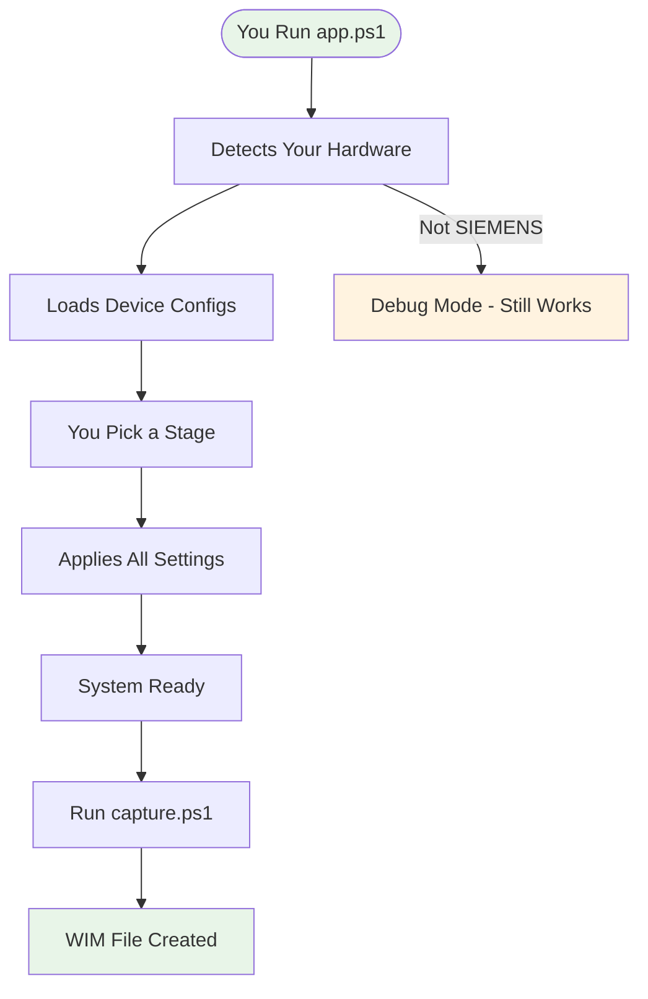
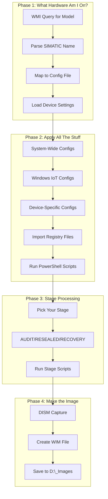
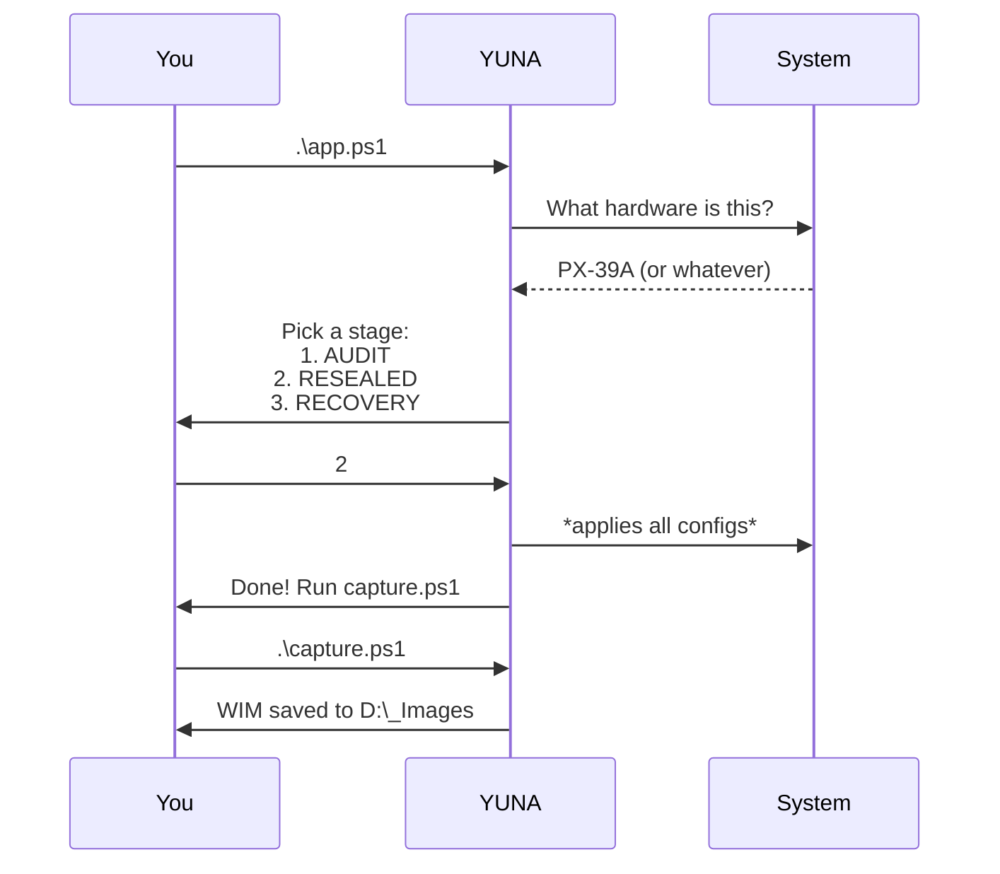
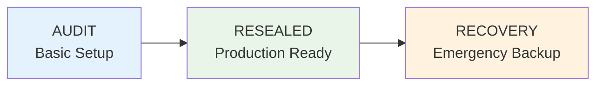
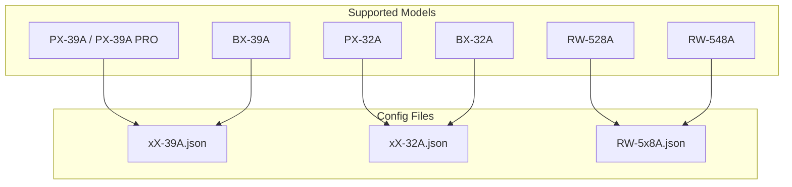
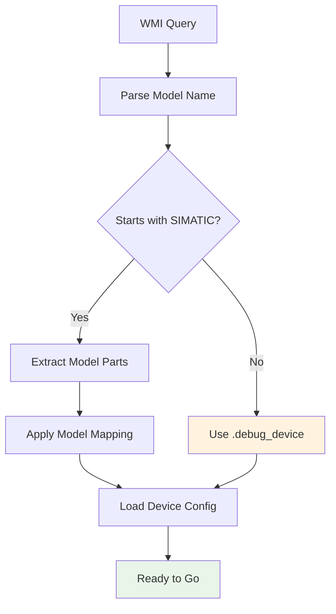
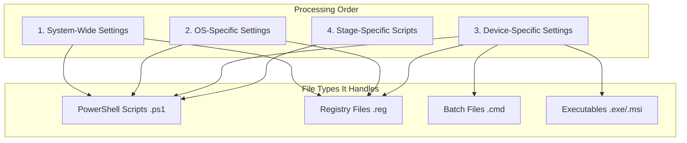
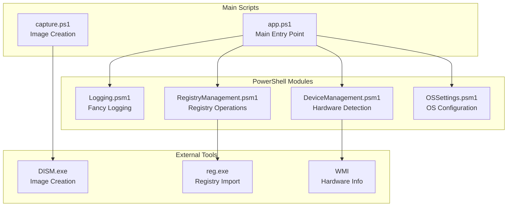
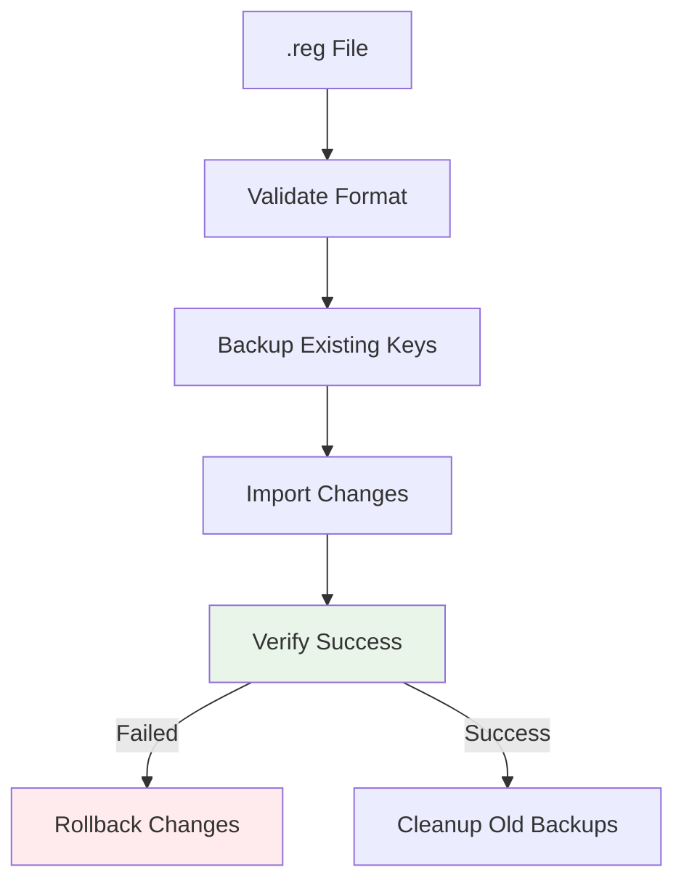

# YUNA - Yielding Universal Node Automation

## Dude, What The Hell Is This Thing?

Look, YUNA is basically a PowerShell automation tool that takes a raw Windows IoT system running on SIEMENS Industrial PCs and spits out a ready-to-deploy WIM image. Think of it as "ImagePrep.exe" but actually useful and not completely broken.

**In Simple Terms:**
- You have a SIEMENS IPC with Windows IoT
- You run YUNA 
- It configures everything automatically based on the hardware it detects
- You get a deployable WIM image
- You're done


---

## How Does This Thing Actually Work?

### The Basic Flow (No BS Version)



### The Detailed Flow (For When You Actually Care)



---

## How Do I Actually Use This Thing?

### The "I Just Want It To Work" Method

```powershell
# Navigate to wherever you put YUNA
cd C:\YUNA

# Just run it
.\app.ps1

# Follow the prompts (it's pretty obvious)
# When it's done, capture the image
.\capture.ps1
```

**What Happens:**
1. YUNA figures out what SIEMENS IPC you're on
2. Shows you 3 options: AUDIT, RESEALED, or RECOVERY
3. You pick one (usually RESEALED for production)
4. It does its thing automatically
5. You capture the image when it's done

### The User Flow (Interactive)



### The "I Want to See What's Happening" Method

```powershell
# Setup verbose logging first
.\Engine\Setup-logging-environment.ps1 -Environment Development -CreateDirectories

# Now run it with full logging
.\app.ps1

# You'll see everything it's doing
```

---

## What Are These "Stages" You Keep Talking About?

Think of stages as different levels of "done-ness" for your image:

### AUDIT Stage
**Translation:** "Basic setup, ready for testing"
- Applies basic configs
- Hardware validation
- Device-specific settings
- Good for testing and validation

### RESEALED Stage  
**Translation:** "Production ready, ship it"
- Windows activation
- SIMATIC branding/themes
- Production software
- Final cleanup and sealing
- This is what you usually want

### RECOVERY Stage
**Translation:** "Oh shit, we need a recovery image"
- Recovery tools
- Backup configurations
- Emergency procedures
- For when things go wrong



---

## What Hardware Does This Actually Support?

### Currently Supported SIEMENS IPCs



**The Detection Logic:**
- Queries WMI for computer model
- If it starts with "SIMATIC", it's supported
- Maps model name to config file
- If no SIMATIC detected, uses debug mode (still works, just generic)

### How Detection Works



**Example:**
- Detects: "SIMATIC IPC PX-39A"
- Extracts: "PX-39A"
- Maps to: "xX-39A"
- Loads: `Devices/xX-39A.json`

---

## The Directory Structure (Where Everything Lives)

```
YUNA/
├── app.ps1                    # START HERE
├── capture.ps1                # RUN THIS AFTER app.ps1
│
├── Engine/                    # The actual code
│   ├── config.json           # Main settings and device mappings
│   ├── logging-config.json   # How verbose you want logs
│   ├── DeviceManagement.psm1 # Figures out what hardware you have
│   ├── Logging.psm1          # Makes pretty logs
│   ├── RegistryManagement.psm1 # Imports .reg files safely
│   ├── OSSettings.psm1       # OS-specific stuff
│   └── Setup-logging-environment.ps1 # Configure logging
│
├── Devices/                  # Hardware-specific configs
│   ├── xX-39A.json          # PX-39A/BX-39A settings
│   ├── xX-32A.json          # PX-32A/BX-32A settings
│   ├── RW-5x8A.json         # RW-series settings
│   └── [ModelName]/          # Device-specific files
│       ├── *.ps1             # PowerShell scripts
│       ├── *.reg             # Registry imports
│       └── *.cmd             # Batch files
│
├── OperatingSystems/         # OS-specific stuff
│   ├── System-Wide/          # Applies to everything
│   └── [WindowsVersion]/     # Specific Windows versions
│       ├── Scripts/
│       ├── Registry/
│       └── stages/           # Stage-specific scripts
│
└── Logs/                     # Where all the logs go
```

---

## Logging - Or "How to See What Went Wrong"

### Logging Modes (Pick Your Poison)

| Mode | Debug | Verbose | Where It Goes | When to Use |
|------|-------|---------|---------------|-------------|
| **Development** | OFF | ON | Console + File | When you're coding/testing |
| **Testing** | ON | OFF | Console + File | When you're validating |
| **Production** | OFF | OFF | File + EventLog | When it's live |
| **Debug** | ON | ON | Console + File | When shit's broken |

### Setup Logging

```powershell
# For development (see everything)
.\Engine\Setup-logging-environment.ps1 -Environment Development

# For production (minimal noise)
.\Engine\Setup-logging-environment.ps1 -Environment Production

# Test your setup
.\Engine\Setup-logging-environment.ps1 -Environment Development -TestConfiguration
```

### What the Logs Look Like

**Development Mode (Verbose):**
```
[INIT] [2025-01-15 10:30:15] [YUNA] Starting up...
[INFO] [2025-01-15 10:30:16] [DeviceDetection] Found PX-39A
[SUCCESS] [2025-01-15 10:30:17] [ConfigLoader] Loaded configs successfully
[APPLYING] [2025-01-15 10:30:20] [RegistryManager] Importing device_settings.reg
[PERF] [2025-01-15 10:30:21] [Timer] Operation took 5.12 seconds
```

**Production Mode (Clean):**
```
2025-01-15T10:30:15Z [INFO] YUNA initialization complete
2025-01-15T10:30:16Z [INFO] PX-39A device detected and validated
2025-01-15T10:30:20Z [SUCCESS] All configurations applied successfully
```

---

## How YUNA Processes Your Stuff

### The Configuration Hierarchy (Order Matters)



### What Each File Type Does

| File Type | How It's Processed | What It's For |
|-----------|-------------------|---------------|
| `.ps1` | `& $scriptPath` | Complex configuration logic |
| `.reg` | `reg import $file` | Registry modifications |
| `.cmd` | `cmd.exe /c $file` | Simple batch operations |
| `.exe` | `Start-Process $file` | Install programs |
| `.msi` | `msiexec.exe /i $file` | Install MSI packages |

---

## The Technical Stuff (For When You Need to Debug)

### The Module Architecture



### Registry Management (The Safe Way)

YUNA doesn't just blindly import registry files. It:

1. **Validates** the file format
2. **Backs up** existing keys
3. **Imports** the changes
4. **Verifies** the import worked
5. **Can roll back** if shit goes wrong



### Performance Monitoring

YUNA tracks how long everything takes:

```powershell
# These operations are automatically timed:
Start-PerformanceTimer -OperationName "YUNA_Total_Execution"
Start-PerformanceTimer -OperationName "Device_Detection" 
Start-PerformanceTimer -OperationName "Registry_Import_Total"
# ... do work ...
Stop-PerformanceTimer -OperationName "Registry_Import_Total"
```

**Typical Times:**
- Device Detection: 1-3 seconds
- Config Loading: 2-5 seconds
- Registry Operations: 10-30 seconds
- Stage Execution: 30-120 seconds
- Image Capture: 5-15 minutes

---

## Troubleshooting (When Things Go Wrong)

### Quick Diagnostics

```powershell
# Check if you have the right PowerShell version
$PSVersionTable.PSVersion  # Should be 5.1+

# Check if you're running as admin
([Security.Principal.WindowsPrincipal][Security.Principal.WindowsIdentity]::GetCurrent()).IsInRole([Security.Principal.WindowsBuiltInRole] "Administrator")

# Test hardware detection
Import-Module .\Engine\DeviceManagement.psm1
Get-DeviceModel

# Check disk space
Get-CimInstance -ClassName Win32_LogicalDisk | Where-Object {$_.DriveType -eq 3}
```

### Common Issues

**"Device not supported"**
- Check if your model is in the mapping: `Engine\config.json`
- Make sure the device config file exists: `Devices\[model].json`
- For non-SIEMENS hardware, it should still work in debug mode

**"Registry import failed"**
- Check if running as admin
- Verify .reg file format
- Look for backup files in temp directory

**"DISM failed"**
- Check disk space (need at least 10GB free)
- Make sure DISM is available: `dism /?`
- Verify D:\_Images directory exists and is writable

### Debug Mode

```powershell
# Enable debug mode in config
$config = Get-Content "Engine\config.json" | ConvertFrom-Json
$config.debug = $true
$config | ConvertTo-Json | Set-Content "Engine\config.json"

# Run with verbose logging
.\Engine\Setup-logging-environment.ps1 -Environment Debug
.\app.ps1
```

---

## System Requirements (The Boring Stuff)

### What You Need
- **PowerShell 5.1+** (comes with Windows)
- **Windows 10/11 IoT Enterprise** (the target OS)
- **8GB RAM minimum** (16GB if you want it to not suck)
- **50GB free disk space** (for image creation)
- **Admin privileges** (obviously)
- **SIEMENS IPC** (or any PC if you want debug mode)

### What It Uses
- **WMI** for hardware detection
- **DISM** for image creation
- **reg.exe** for registry operations
- **PowerShell modules** for everything else

---

## Adding New Device Support (For Developers)

### 1. Create Device Config

Create `Devices/NewModel.json`:
```json
{
    "DeviceModel": "NewModel",
    "SupportedOS": {
        "Windows 10 IoT Enterprise": {},
        "Windows 11 IoT Enterprise": {}
    },
    "CustomScript": "setup.ps1",
    "RegistryFile": "device.reg",
    "DriverInstaller": "drivers.exe"
}
```

### 2. Add Model Mapping

Update `Engine/config.json`:
```json
{
    "modelMapping": {
        "NEW-SIEMENS-MODEL": "NewModel"
    }
}
```

### 3. Create Device Files

```
Devices/
├── NewModel.json
└── NewModel/
    ├── setup.ps1
    ├── device.reg
    └── drivers.exe
```

### 4. Test It

```powershell
# Test the detection
Import-Module .\Engine\DeviceManagement.psm1
Get-DeviceModel

# Run YUNA
.\app.ps1
```

---

## Quick Reference

### Essential Commands
```powershell
# Setup logging for development
.\Engine\Setup-logging-environment.ps1 -Environment Development -CreateDirectories

# Run YUNA
.\app.ps1

# Capture image
.\capture.ps1

# Check what device was detected
Import-Module .\Engine\DeviceManagement.psm1; Get-DeviceModel

# View recent performance logs
Get-Content "Logs\YUNA_*.log" | Select-String "PERF" | Select-Object -Last 10
```

### File Locations
- **Main config**: `Engine\config.json`
- **Device configs**: `Devices\*.json`
- **Logs**: `Logs\YUNA_*.log`
- **Output images**: `D:\_Images\`
- **Registry backups**: `%TEMP%\YUNA_Registry_Backups\`

### Supported Hardware
- BX-39A, PX-39A, PX-39A PRO → `xX-39A.json`
- BX-32A, PX-32A → `xX-32A.json`  
- RW-528A, RW-548A → `RW-5x8A.json`

---

## The Bottom Line

YUNA takes the pain out of creating Windows IoT images for SIEMENS IPCs. Instead of manually configuring everything and hoping you didn't miss anything, you run two commands and get a deployable image.

It's not magic - it's just good automation that actually works.


**TL;DR:** Run `.\app.ps1`, pick a stage, run `.\capture.ps1`, deploy your image. Done.